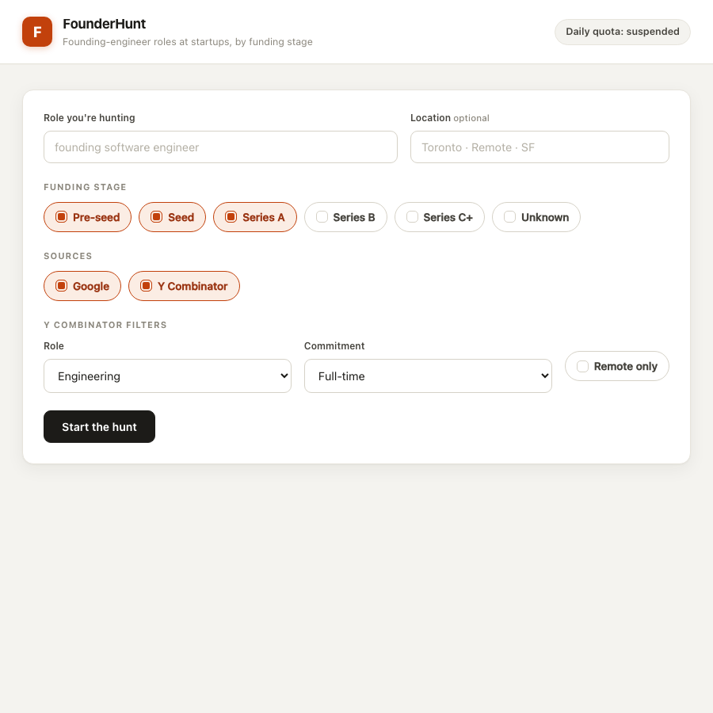

# FounderHunt

Find **founding-engineer / early-engineer roles at startups**, filtered by
**funding stage**. FounderHunt drives a real Chromium browser (Playwright) to
scrape **Google** and **Y Combinator's workatastartup.com**, normalizes every
posting with **Google Gemini**, and shows the results in a table with CSV export.

When a source hits a sign-in wall or captcha, FounderHunt opens the browser
visibly and gives you **60 seconds** to clear it by hand, then resumes — the
**human-in-the-loop checkpoint protocol** (SPEC section 5).



## Quick start

```bash
make install          # venv + dependencies + Chromium  (one time)
# put your key in .env:  GEMINI_API_KEY=...
make run               # starts the app on http://127.0.0.1:8000
```

Then open <http://127.0.0.1:8000>.

`make install` copies `.env.example` to `.env`. Get a free Gemini API key at
<https://aistudio.google.com/app/apikey> and set `GEMINI_API_KEY` in `.env`.
Without it, searches fail fast with a clear message.

`make test` runs the author's test suite. `make clean` removes local artifacts.

> A search opens one or two **visible Chromium windows** — that is by design,
> so you can solve any wall yourself. Keep them on screen while a search runs.

## Architecture

```
Browser UI ──HTTP──▶ FastAPI (app/main.py)
                        │  POST /api/search  → 202 + search_id
                        ▼
              in-process asyncio worker (app/worker.py)
                        │  one task per source (own Chromium)
            ┌───────────┴───────────┐
       Google adapter           YC adapter        (app/adapters/*)
            │                       │
       checkpoint  ◀── wall? ──▶ checkpoint        (app/checkpoint.py)
            │                       │
            ▼                       ▼
       Gemini normalization (app/gemini.py) → SQLite (app/models.py)
```

- **Backend / API** — FastAPI. `POST /api/search` validates input, enforces the
  quota, stores the search, returns `202` immediately, and schedules ingestion.
- **Worker** — an in-process `asyncio` task per search. Each *source* runs as
  its own task with its own Chromium browser, so the two sources are isolated
  (SPEC 5.5). No Redis/Celery: keeps the run model a single command, and the
  visible-browser checkpoint must run on the host anyway.
- **Adapters** — Playwright (Chromium, visible). Every adapter call is wrapped
  defensively: a brittle selector degrades to a progress note, never a crash.
- **Gemini** — one call per posting normalizes raw page text into the SPEC 4.4
  schema, infers the funding `stage`, and canonicalizes the tech stack (S5).
- **Persistence** — SQLite via SQLModel: `Search`, `Job`, `SourceOutcome`.

### The checkpoint design (the hard part)

`app/checkpoint.py` is a small state machine, deliberately split into two parts
so the logic is testable:

- `detect_wall(...)` — a **pure function**. A wall is a login URL, a wall-ish
  page title, a captcha/Cloudflare/password selector, or wall body text. Any one
  signal is enough (SPEC 5.1).
- `run_checkpoint(page, reporter, timeout, ...)` — the **timer loop**. On every
  navigation an adapter calls it. If no wall: returns instantly. If a wall: it
  flips the search to `needs_attention`, starts a 60-second timer, and re-checks
  the live page every ~1.5s. The instant the wall clears it returns and the
  adapter **resumes where it left off**. If the timer expires it raises
  `CheckpointTimeout`; the adapter stops and keeps whatever it had collected, and
  that source ends `needs_attention`.

The loop is decoupled from Playwright via the `wall_detector` argument, so the
state machine is unit-tested without a browser (`tests/test_checkpoint.py`).
Walls re-engage the protocol *every* time they are seen (SPEC 5.4) — there is no
once-per-source limit. `SourceOutcome` rows carry `wall_active` + `wall_deadline`
so the UI can show a live "Ns remaining" countdown.

## API

| Method | Path | Notes |
|--------|------|-------|
| `POST` | `/api/search` | `query`, `stages`, `sources` required; `location`, `yc_filters` optional. `202` + `search_id`. `422` on empty fields, `429` over quota. |
| `GET`  | `/api/search/{id}` | Status, per-source breakdown (outcome / jobs / walls / time), jobs so far. |
| `GET`  | `/api/search/{id}/export.csv` | The results table as CSV. |
| `POST` | `/api/search/{id}/resume` | Retry a `needs_attention` source (S2). |
| `GET`  | `/api/quota` | Remaining searches today for `X-User-Id`. |
| `GET`  | `/docs`, `/openapi.json` | Auto-generated OpenAPI (S3). |

Users are identified by the **`X-User-Id` header** (the UI generates a stable id
in `localStorage`).

## Stretch goals

- **S1** per-source breakdown in the UI — done.
- **S2** `POST /api/search/{id}/resume` — done.
- **S3** OpenAPI docs at `/docs` — done.
- **S4** persistent Playwright session in `playwright-state/` — done; fewer walls
  on later runs.
- **S5** Gemini tech-stack canonicalization — done (in the normalization prompt).

## Decisions & tradeoffs

- **Gemini model** defaults to `gemini-2.0-flash` (the SPEC-recommended free-tier
  model). Override with `GEMINI_MODEL` in `.env`. The `google-generativeai` SDK
  prints a deprecation `FutureWarning` on import — harmless; the SDK is fixed by
  the spec.
- **Sources run concurrently** (`SOURCES_CONCURRENT=true`) to satisfy CORE 4.2.
  Each source has its own browser, so this also gives clean isolation. Two
  visible windows can appear at once — set `SOURCES_CONCURRENT=false` to run them
  one at a time if you prefer a single browser to focus on.
- **Stage inference** is done directly by Gemini from the posting text (CORE
  4.5). For YC, a batch tag (`W25`, `S24`) found in the text deterministically
  overrides Gemini's guess. The SPEC "as-built" Crunchbase-lookup detour was left
  out to stay inside the time budget; the CORE requirement is met.
- **Quota** is disabled by default (`QUOTA_ENABLED=false`, per SPEC 4.6
  "as built"); the endpoints and tracking work when enabled.
- **Scraping is best-effort.** Live Google/YC markup changes constantly; adapters
  degrade gracefully rather than crash. The engineering focus is the checkpoint
  state machine, the worker isolation, and the API contract.

## Tests

`make test` — `tests/` covers API validation/contract, the checkpoint state
machine (detection + clear + timeout), pure normalization/dedup/stage logic, and
the quota. They need no network and no API key.
